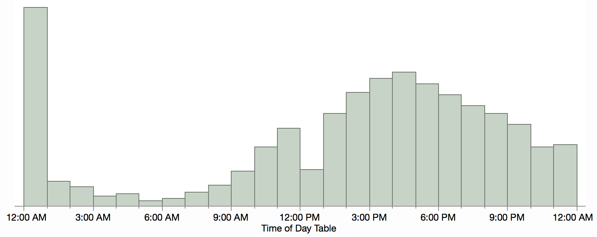
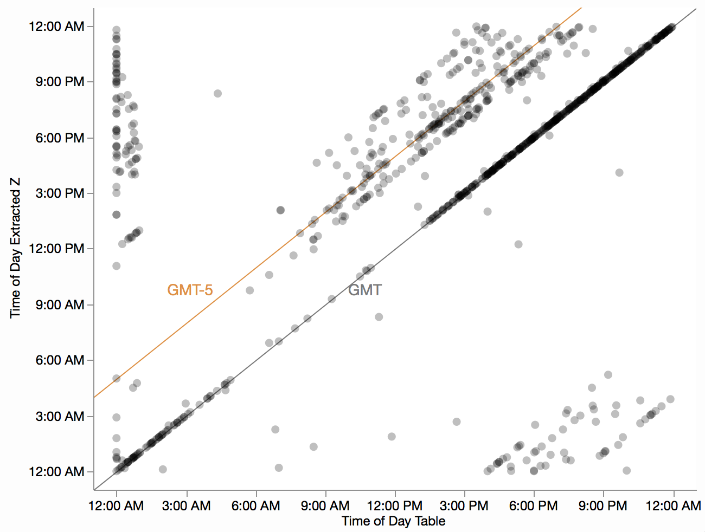
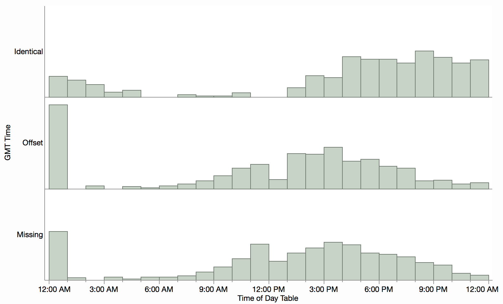

# Drone Sighting Times

I'm using [JMP](http://jmp.com/) to explore the drone data set, inspired by the [weekly data viz challenge](https://rud.is/b/2016/03/30/introducing-a-weekly-r-python-js-etc-vis-challenge) from [@hrbrmstr][http://twitter.com/hrbrmstr). JMP's strength is interactive statistics and data visualization, but it does have a scripting language (JSL) which I'll use here in the spirit of reproducibility.

## Preparation

Reading Excel files is normally done with the Excel import UI but these files are simple enough for the default settings so the script is just a plain `Open` call. The column names are a bit messy, so I cleaned those up.

```javascript
dt1 = Open("UASEventsNov2014-Aug2015.xls");

// delete uniformative columns
dt1 << Delete Column("Item Type");
dt1 << Delete Column("Path");

Column(dt1, 1) << Set Name("DateTime");
Column(dt1, 2) << Set Name("City");
Column(dt1, 3) << Set Name("State");
Column(dt1, 4) << Set Name("Report");

dt2 = Open("UAS_Sightings_report_21Aug-31Jan.xlsx");
Column(dt2, 1) << Set Name("DateTime");
Column(dt2, 2) << Set Name("Report");
Column(dt2, 3) << Set Name("City");
Column(dt2, 4) << Set Name("State");
```

After getting the column names to match, it's easy to append the tables to each other, even with the columns in different orders.

```javascript
dt3 = dt1 << Concatenate(dt2);
```

## Time of Day

I started playing with the data and noticed some quality issues with the time field. I create a new column that extracts the time of day from the `DateTime` column and make a histogram for it. I call it `Time of Day Table` because I'll be computing a different time of day later.

```javascript
dt3 << New Column("Time of Day Table", Format("h:m"), Formula(Time of Day(:DateTime)));

dt3 << Graph Builder(
	Size( 750, 350 ),
	Show Control Panel( 0 ),
	Show Legend( 0 ),
	Variables( X( :Time of Day Table ) ),
	Elements( Histogram( X ) ),
	SendToReport(
		Dispatch( {}, "Time of Day Table", ScaleBox,
			{Min( -1500. ), Max( 87800 ), Interval( "Hour" ),
			Inc( 3 ), Minor Ticks( 2 )}
		)
	)
);
```



The most noticeable feature is the spike at midnight. It turns out there are a lot of times reported as exactly 12:00 AM, apparently as a missing value code. A second feature is the smaller but significant dip at noon. Likely, some of the noon times have had the AM/PM part miscoded and some of the noon-hour times are reported in the midnight-hour slot (in addition to the missing value times).

While the distribution looks nice otherwise, it does seem to be a more shifted toward the evening hours than expected. If only there was some way to quality check the time values...

## Extracting GMT Time

There is! The `Report` column contains free text describing the incident and often includes a report time in 24-hour GMT (note the Z suffix).

!(editcell.png "Free text field example")

*(Note for future exploration: sometimes there is altitude data there.)*

So let's extract the GMT time and compare with the time in the table. I'll make a new formula column based on a regex to extract the 4 digit time.

```javascript
dt3 << New Column("hhmm", 
	Formula(Num( Regex( :Report, "Time: .+ (\d+)Z", "\1" )))
);
```

And another one to convert it to a JMP time value (number of seconds) `Time of Day Extracted Z`:

```javascript
dt3 << New Column("Time of Day Extracted Z", Format("h:m"),
	Formula( In Hours( Floor( :hhmm / 100 ) ) + In Minutes( Modulo( :hhmm, 100 ) ))
);
```

Plotting the two time fields against each other shows some interesting patterns.

```javascript
dt3 << Graph Builder(
	Size( 639, 510 ),
	Show Control Panel( 0 ),
	Variables( X( :Time of Day Table ), Y( :Time of Day Extracted Z ) ),
	Elements( Points( X, Y, Legend( 8 ) ) ),
	SendToReport(
		Dispatch( {}, "Time of Day Table", ScaleBox,
			{Label Row( Label Orientation( "Horizontal" ) )}
		),
		Dispatch( {}, "400", ScaleBox,
			{Legend Model( 8, Properties( 0, {Transparency( 0.25 )} ) )}
		),
		Dispatch( {}, "Graph Builder", FrameBox,
			{Add Graphics Script( 2, Description( "Script" ),
				Pen Color( "dark gray" );
				Y Function( x, x );
				Text Color( "dark gray" );
				Text( {In Hours( 10 ), In Hours( 9.5 )}, "GMT" );

				Pen Color( "orange" );
				Y Function( x + In Hours( 5 ), x );
				Text Color( "orange" );
				Text( {In Hours( 2.2 ), In Hours( 9.5 )}, "GMT-5" );
			), Grid Line Order( 1 ), Reference Line Order( 3 )}
		)
	)
);
```



I added two diagonal reference lines. The orange one corresponds to EST and the diagonal clusters near it are other US time zones. The graph diagonal is where the time in the table is the same as GMT. Lots of those! Few of those occur before 1 PM (1300Z) hours, which seems reasonable for GMT sighting times in the US but not for local times.

## Categorizing

We can think of the times as falling into three categories:

* Missing -- there was no GMT time within the free text
* Identical -- the GMT time was the same as the "local" time
* Offset -- the GMT time was at an offset from the local time, usually something reasonable for the US

I added a couple columns to compute that classification and then plotted a histogram for each category.

```javascript
dt3 << New Column("Delta", 
	Formula( Mod((:Time of Day Extracted Z - :Time of Day Table) / In Hours(1) + 24, 24))
);

dt3 << New Column("GMT Time", "Character",
	Formula( If( Abs(:Time of Day Table - :Time of Day Extracted Z) <= In Minutes(10), "Identical",
			Is Missing(:Time of Day Extracted Z), "Missing", "Offset"
	)),
	Set Property( "Value Ordering", {"Missing", "Offset", "Identical"} )
);

dt3 << Graph Builder(
	Size( 793, 498 ),
	Show Control Panel( 0 ),
	Show Legend( 0 ),
	Variables( X( :Time of Day Table ), Y( :GMT Time) ),
	Elements( Histogram( X, Y, Legend( 1 ) ) ),
	SendToReport(
		Dispatch( {}, "Time of Day Table", ScaleBox,
			{Min( -911.002925858029 ), Max( 87152.6132404181 ), Interval( "Hour" ),
			Inc( 3 ), Minor Ticks( 2 ),
			Label Row( Label Orientation( "Horizontal" ) )}
		)
	)
);
```


Now we can see how the `Identical` categorty was skewing the local times into the evening. The `Offset` category has a more expected peak during daylight hours and matches well with the times where the GMT times were `Missing`. Both of the latter suffer from the 12:00 AM spike and 12:00 PM drop, due to coding issues. It's unclear why the `Identical` category has a mostly uniform distribution. It could be a combination of two offset normal distributions, one for the east coast and on for the west coast.

## Conclusion

By considering the extracted GMT time, we can filter out suspicious time values for further time-based analysis.


